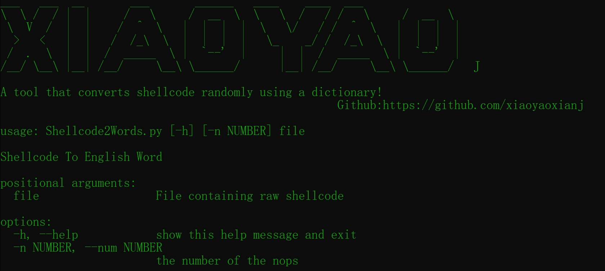
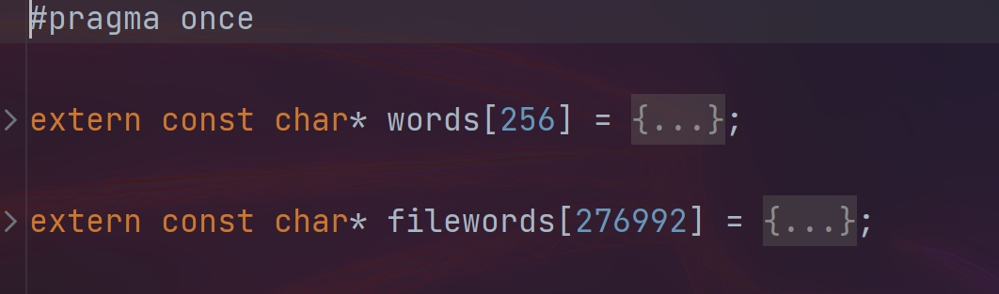

# Shellcode2Words

**Author:** https://github.com/xiaoyaoxianj

  This project was inspired by Shhhloader(https://github.com/icyguider/Shhhloader).I extracted the function points from the project to facilitate shellcode conversion.
  
  We can use any dictionary to randomly convert shellcode.You can customize the number of **NOPs** you want to add to the shellcode header.
  
  When the script is executed, an .h file is generated that contains the converted password dictionary and shellcode

### Help

You can customize the number of **NOPs** you want to add

#### 

### Usage

```python
python Shellcode2Words.py xiaoyaoj.bin -nop n
```
### Result



